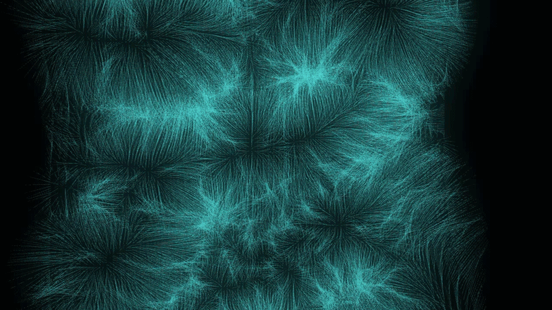

# Hello there!👋 I'm Vlad 

<p align="center">

</p>

<div align="center">Responsive and interactive web experiences with UI design, 3D and generative visuals.</div>

---

## ⭐ About me

Hey there, I'm a **Creative Frontend Developer** focused on the intersection of **design and code**. I enjoy taking an idea from a visual concept or Figma layout and turning it into a polished and interactive experience.

My long-term direction is **Creative Development**. I enjoy combining frontend development with design or 3D generative design and experimental web experiences. My goal is to move from building conventional interfaces to creating **distinctive digital experiences with design, code, motion and 3D working together**.

```text
DESIGN
  ↓
Figma · Photoshop · Illustrator · Visual concepts
  ↓
FRONTEND
  ↓
HTML · CSS · JavaScript · Responsive UI
  ↓
INTERACTION
  ↓
GSAP · Motion · Creative interactions
  ↓
CREATIVE DEVELOPMENT
  ↓
Three.js · WebGL · Blender · Generative Design
```
<p align="center">
  
</p>

---

## 🛠️ Tech & Tools

### Frontend


### Backend


### Design


### Currently Exploring


## 🎯 Current focus

```text
✓ HTML / CSS
✓ JavaScript
✓ Responsive Web Design
✓ Figma
✓ UI Design
✓ Node.js / Express
✓ PostgreSQL

→ GSAP
→ React
→ Three.js
→ Blender
→ WebGL / Shaders
→ Generative Web
```
---
